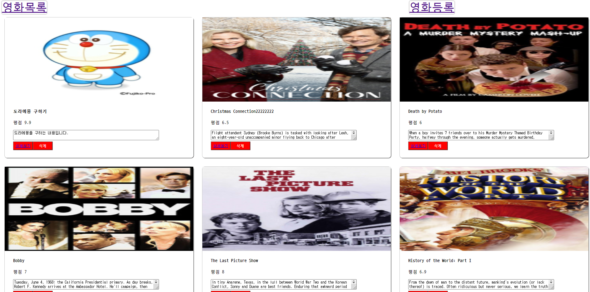
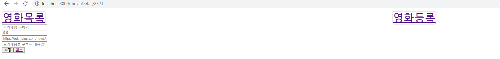
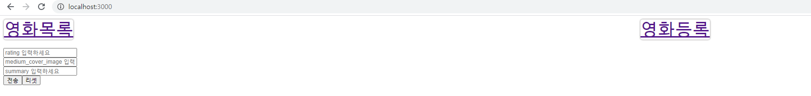

# Style-Component-연습

### 사진





### 설치

- npx create-react-app exam-app

### 확장 프로그램

- ESLint
- Prettier
- Reactjs code snippets
- vscode-styled-component

### .prettier 파일생성

```json
{
  "singleQuote": true,
  "semi": true,
  "useTabs": false,
  "tabWidth": 2,
  "trailingComma": "all",
  "printWidth": 80
}
```

### 라이브러리

- npm install --save styled-components
- npm i react-router-dom

### Git 관리

- git init (박스 3개 만들기)
- git add . (두번째 박스 옮기기 - 사진찍기)
- git commit -m "" (세번째 박스로 옮기기 - 사진첩 옮기기)

- git hub 저장소 만들기
- git remote add origin 주소.git (원격지 연결)
- git push origin master (업로드)

- 다운로드
- git pull origin master (다운로드)
- npm install (의존성 다운로드 - node_modules 설치)
